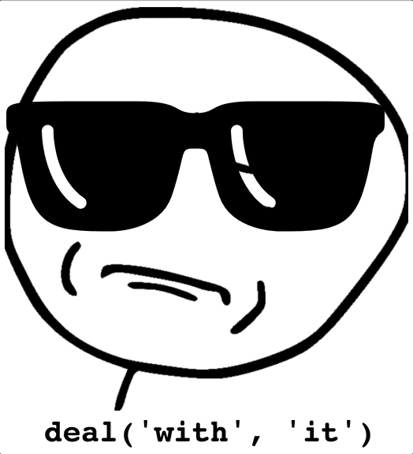

## shades

1. [intro](#intro)
2. [playground](#try)
3. [guide](#guide)
   1. [Traversals](#traversals)
   2. [Folds](#folds)
   3. [Virtual Lenses](#virtual)
4. [api](#api)

## _New in v2!_

- Rich and fully type-safe Typescript support!
- 0 dependencies!
- < 5kb (gzipped) build!

## Watch an Introduction

[](https://www.youtube.com/watch?v=_D3IPecC0S8)

<a name="intro"></a>
Shades is a [lodash](https://github.com/lodash/lodash) inspired [lens](https://www.schoolofhaskell.com/school/to-infinity-and-beyond/pick-of-the-week/basic-lensing)-like library.
_(Psst! Don't want to learn about lenses? Start with the [collection functions](#collection-transformations) to see how you can clean up your Iterable code, or check out the magic of [`into`](#into))._

A lens is a path into an object, which can be used to extract its values, or even "modify" them in place (by creating a new object with the value changed).

When writing immutable code, we very commonly end up with nested data stores, e.g.:

```js
const store = {
  users: [
    {
      name: 'Jack Sparrow',
      posts: [
        {
          title: 'Why is the rum always gone? An analysis of Carribean trade surplus'
        }
      ],
      ...
    },
  ...
  ]
}
```

And updating a nested structure will require heavy usage of the spread operator (or `Object.assign`). E.g. To capitalize the title of the first post of the first user, you would write:

```js
const userIdx = 0;
const postIdx = 0;
const capitalize = (string) => {...}

{...store,
  users: store.users.map((user, idx) => (
    idx === userIdx
    ? {...user,
        posts: user.posts.map((post, idx) =>
          idx === postIdx
          ? {
              ...post,
              title: capitalize(post.title)
            }
          : post)
      }
    : user
    ))
}
```

This is an enormous amount of obfuscating boiler plate code for a very simple update.

With lenses, we could write this update much more declaratively:

```js
mod('users', userIdx, 'posts', postIdx, 'title')
  (capitalize)
  (store);
```



### Typings

If you're using TypeScript, you'll benefit from very robust type-checking. For example if we had typed the above as:

```js
mod('users', userIdx, 'pots', postIdx, 'title')(capitalize)(store)
```

TS will error on `store` because it doesn't have an attribute `pots`. Similarly,

```typescript
mod('users', userIdx, 'posts', postIdx, 'title')((x: number) => x + 1)(store);
```

will error because the type of `title` is `string` and not `number`

## <a name="try"></a>Try It Out

shades contains a little node playground that you can use to follow along with the guide or generally mess around with it.

You can run it with [`npx`](https://medium.com/@maybekatz/introducing-npx-an-npm-package-runner-55f7d4bd282b)(which you already have if you're running `npm@^5.2.x`):

```sh
npx shades
```

Or the old fashioned way

```sh
npm install --global shades
shades
```

## <a name="guide"></a> Let's Talk About Lens, Baby

For reference, we will use the following objects:
<a name="store"></a>

```js
const jack = {
  name: 'Jack Sparrow',
  goldMember: false,
  posts: [
    {
      title:
        'Why is the rum always gone? An analysis of Carribean trade surplus',
      likes: 5
    },
    {
      title: 'Sea Turtles - The Tortoise and the Hair',
      likes: 70
    }
  ]
};

const liz = {
  name: 'Elizabeth Swan',
  goldMember: true,
  posts: [
    {
      title: 'Bloody Pirates - My Life Aboard the Black Pearl',
      likes: 10000
    },
    {
      title:
        'Guidelines - When YOU need to be disinclined to acquiesce to their request',
      likes: 5000
    }
  ]
};

const bill = {
  name: 'Bill Turner',
  goldMember: false,
  posts: [
    {
      title: 'Bootstraps Bootstraps - UEFI, GRUB and the Linux Kernel',
      likes: 3000
    }
  ]
};

const store = {
  users: [jack, liz, bill],
  byName: {
    jack,
    liz,
    bill
  }
};
```

#### Baby's first lens

Conceptually, a lens is something that represents a path through an object.

The simplest lens is a string or number path like `'name'` or `0`. Strings represent object properties and numbers represent Array or Object indexes.

`get` is the simplest lens consumer. It takes a lens into an object and produces a function that will take an object and produce the _focus_ of that lens (focus = final value referenced by the lens, i.e. `name` or `posts`). Using the examples from above:

```js
> const getName = get('name')
> getName(jack)
'Jack Sparrow'
```

or more succinctly:

```js
> get('name')(jack)
'Jack Sparrow'
```

Multiple lenses can be passed in to `get` and they will be composed left-to-right:

```js
> get('users', 0, 'name')(store)
'Jack Sparrow'
```

This is all well and good, but that `0` is unrealistic. We rarely know _which_ index of an array we need to edit, instead we want to update all elements that match some criterion. Thus we need a way to focus on multiple points in an array (or object).

#### <a name="traversals"></a>Baby's first traversal

This is where stuff starts to get interesting.

[Traversals](#traversals) split the focus of lenses into _multiple_ focus points. These can be particularly helpful when working with arrays.

The simplest traversal is [`all`](#all). `all` focuses on every element of an array (or every value in an object).

```js
> get('users', all, 'posts')(store)
[
  [ { title: 'Why is the rum always gone? An analysis of Carribean trade surplus', likes: 5} ],
  [ { title: 'Bloody Pirates - My Life Aboard the Black Pearl', likes: 10000 } ]
]
```

_Note: if you are using the TypeScript bindings, you MUST call `all` as a function, e.g. `get('users', all(), 'posts')`. It behaves exactly the same way._

Traversals can be used anywhere a lens is used. However, as you can see above, when `all` appears in a composition, everything after is applied to every element of a collection, instead of on a single object. In this way, traversals act like prisms:


Multiple traversals can be composed into a single lens. Each traversal in the lens will result to a further level of nesting in the output

```js
> get('users', all, 'posts', all, 'likes')(store)
[[5], [100000]]
```

Above, we focused on the `users` key of the store, then for every user in the `users` array we focused on the posts array, and then for every post in THAT array we focused on the `likes` key.

`all` will always produce an array in the output, and so we got an array for when we traversed over `users`, and another nested array when we traversed over `posts`. Pretty neat, huh?

#### Modifications

`get`ting data is all well and good, but where shades really shines is performing immutable updates. The good news is everything we have learned up until now translates seamlessly.

Meet `mod`. `mod` is a lot like `get`: it accepts lenses and produces a function. The difference is, before we pass `mod` an object to act on, we pass it a function that transforms the focus of the lens. Then we pass it an object, and instead of producing the focus of the object (like `get`) it will produce a copy of the entire object, with the focus of the lens transformed by your function.

```js
> const transformer = mod('users', 0, 'posts', 0, 'likes')(likes => likes + 1)
> transformer(store)
{
  users: [
    {
      name: 'Jack Sparrow',
      goldMember: false,
      posts: [
        {
          title: 'Why is the rum always gone? An analysis of Carribean trade surplus',
          likes: 6, // <---- Incremented!!
        }
      ]
    },
    { ... },
    { ... }
  ]
}
```

This transform was done immutably, so our original `store` is unmodified.

`mod` also works with traversals:

```js
> mod('users', all, 'posts', all, 'likes')(likes => likes + 1)(store)
{
  users: [
    {
      name: 'Jack Sparrow',
      goldMember: false,
      posts: [
        {
          title: 'Why is the rum always gone? An analysis of Carribean trade surplus',
          likes: 6, // <---- Incremented!!
        }
      ]
    },
    {
      name: 'Elizabeth Swan',
      goldMember: true,
      posts: [
        {
          title: 'Bloody Pirates - My Life Aboard the Black Pearl',
          likes: 10001, // <---- Also Incremented!! Wow!
        }
      ]
    },
    { ... }
  ]
}
```

Now you're ready to start cooking with gas! If you wanna see an even cooler traversal, check out [`matching`](#matching). Or just check out some of the API below, there's a
lot of really great stuff we didn't even get a chance to touch on.

### Epilogue: Folds and Virtual Lenses

You'll be able to get pretty dang far with just the built in lenses and traversals described above. But if you really want to dive down the rabbit hole, there's even more
you can do with lenses.

#### <a name="folds"></a>Folds

Traversals allowed us to focus on multiple elements from a collection at once, but what if we just want to focus on a single element in a collection; one that fits some
criterion. This is a fold. Think of `Array::reduce`; folds operate very similarly. There are some built-in folds that should help you get the hang of it. For instance, [`findBy`](#findBy):

```js
> get('users', findBy(user => user.name === 'Jack Sparrow'), 'name')
'Jack Sparrow'
```

There are other folding lenses such as `maxBy`, and `minBy` (guess what they do). They all support the [`into` shorthand](#into):

```js
> get('users', findBy({name: includesi('jack')}), 'name')(store)
'Jack Sparrow'

> get('users', findBy('Elizabeth Swan'), 'posts', maxBy('likes'), 'title')
'Bloody Pirates - My Life Aboard the Black Pearl'
```

#### <a name="virtual"></a>Virtual Lenses

Lenses are not magic. They are just objects with a `get` and a `mod` field. You can create easily create your own; in fact, this is how [folds](#folds) are implemented.

For example, let's say that your data represents temperature in Celsius, but being an American, you only understand Fahrenheit. We just need to create a `get`
function that takes a temperature in Celsius transforms it to Fahrenheit, and then a function `mod` that takes a _function_ from Fahrenheit to Fahrenheit, and produces
a Celsius to Celsius function.

let's start with some conversion functions:

```javascript
const ftoc = f => (f - 32) / 1.8;
const ctof = c => c * 1.8 + 32;
```

our `get` function is just `ctof` (by definition it is a Celsius to Fahrenheit function), but our `mod` function is more complicated. We will get an updater that works on Fahrenheit, but we need to produce a Celsius updater. So we will create a function that takes the temperature in Celsius, converts it to Fahrenheit, runs it through the updater, and converts the result back to Celsius:

```js
const inF = {
  get: ctof,
  mod: ftof => c => ftoc(ftof(ctof(c)))
};
```

Now we have a lens that will let us view and update temperatures in Celsius as if they are in Fahrenheit

```js
const weather = { temp: 35 }

> get('temp')(weather)
35

> get('temp', inF)(weather)
95

> mod('temp', inF)(x => x + 1)(weather)
{ temp: 35.56 }

> set('temp', inF)(23)(weather)
{ temp: -5 }
```

For more details on virtual lenses, watch my talk at Reactathon:

[](https://www.youtube.com/watch?v=_D3IPecC0S8)

## <a name="api">API</a>

#### _A Note on Type Signatures_

It's not necessary to fully grok the type signatures when you read them, but if you do want to understand some of the custom types,
they can be found in [types/utils.ts](types/utils.ts)

### <a href='into'>into</a>
```typescript
export function into<Fn extends (...a: any[]) => any>(f: Fn): Fn;
export function into<Key extends string>(f: Key): <Obj extends HasKey<Key>>(s: Obj) => Obj[Key];
export function into<Pattern extends object>(p: Pattern): (o: HasPattern<Pattern>) => boolean;
```

`into` is the engine of much of shades' magical goodness. It takes either a string or object 
(or function) and turns it into a useful function. All of shades [collection functions](#collection-transformations)
will automatically pass their inputs into `into`, creating a useful shorthand.

The transformation follows one of the following 3 rules:
* a **function** is returned as is (easy enough)
* a **string** or **number** is converted into a lens accessor with [`get`](#get)
* an **object** is converted into a predicate function using the function [`has`](#has). This one is the most interesting, and
requires some explanation.

In the simplest form, a pattern of keys and values will produce a function that takes a test 
value and returns `true` if the given test value has at least the equivalent keys and values 
of the pattern. Using the [store](#store) example from above:

```js
// Tests if an object passed to it has the key goldMember mapped to true
> const isGoldMember = into({goldMember: true})
> isGoldMember(jack)
false

// test multiple values
> into({goldMember: true, name: "Elizabeth Swan"})(liz)
true
```

Nested values work just as you'd expect:
```js
> into({jack: {goldMember: false}})(store.byName)
true
```

Where it REALLY gets interesting is when the _values_ in your pattern are predicate functions. 
In this case, the value at that key in the test object is passed to the function, and validation 
only continues if that function returns `true`

```js
// Tests if the object passed to it has a title attribute that is less than 50 letters long
> const hasShortTitle = into({title: title => title.length < 50})
> hasShortTitle(jack.posts[0])
false
```
This pattern is especially useful with [lenses and traversals](#guide)


<details><summary><em>TypeScript Usage</em></summary>
<p>

```typescript
into('a')({a: 10}) // $ExpectType number
into('b')({a: 10}) // $ExpectError
into({a: 10})({a: 10}) // $ExpectType boolean
into({a: 10})({b: 10}) // $ExpectError
into((x: number) => x + 1)(10) // $ExpectType number

```

</p>
</details>

<details><summary><em>Tests</em></summary>
<p>

```javascript
it('should use into to create functions', () => {
  into('a')({ a: 10 }).should.equal(10);
  into({ a: 10 })({ a: 10 }).should.be.true;
  into(x => x + 1)(10).should.equal(11);
});

```

</p>
</details>


## <a href=reducer-generators>Reducer generators</a>
Reducer generators are functions that take [`into patterns`](#into) and produce specialized
reducer functions (`(A, S) => A`):

```js
> jack.posts.reduce(maxOf('likes'))
{
  title: 'Sea Turtles - The Tortoise and the Hair',
  likes: 70
}
```

### <a href='maxOf'>maxOf</a>
```typescript
export function maxOf<Key extends string>(k: Key): <Item extends HasKey<Key, number>>(acc: Item, current: Item) => Item
export function maxOf<A>(f: (a: A) => number): (acc: A, current: A) => A
```

A reducer generator that takes either a path or a getter function and producers 
a reducer that will find the element in the collection that has the max of that
property

```js
> [{a: 1}, {a: 3}, {a: 2}].reduce(maxOf('a'))
{ a: 3 }

> store.users.reduce(maxOf(user => user.name.length))
{ name: 'Elizabeth Swan', ...}
```


<details><summary><em>TypeScript Usage</em></summary>
<p>

```typescript
users[0].posts.reduce(maxOf('likes')) // $ExpectType Post
users[0].posts.reduce(maxOf('title')) // $ExpectError
users[0].posts.reduce(maxOf('farts')) // $ExpectError
users.reduce(maxOf(user => user.name.length)) // $ExpectType User
users.reduce(maxOf(user => user.name)) // $ExpectError

```

</p>
</details>

<details><summary><em>Tests</em></summary>
<p>

```javascript
it('should find largest elements', () => {
  store.users.reduce(maxOf(user => user.name.length)).should.be.equal(liz)
  jack.posts.reduce(maxOf('likes')).likes.should.be.equal(70)
})

```

</p>
</details>

### <a href='minOf'>minOf</a>
```typescript
export function minOf<Key extends string>(k: Key): <Item extends HasKey<Key, number>>(acc: Item, current: Item) => Item
export function minOf<Item>(f: (a: Item) => number): (acc: Item, current: Item) => Item
```

The opposite of [`maxOf`](#maxOf).


### <a href='findOf'>findOf</a>
```typescript
export function findOf<Key extends string>(k: Key): <Item extends HasKey<Key>>(acc: Item, item: Item) => Item
export function findOf<Item>(f: (a: Item) => any): (acc: Item, current: Item) => Item
export function findOf<Pattern>(p: Pattern): <Item extends HasPattern<Pattern>>(acc: Item, item: Item) => Item
```

Takes an [into pattern](#into) and produces a reducer that returns either the accumulated item
or the current item if it passes the given test.

```js
> store.users.reduce(findOf('goldMember'))
liz

> store.users.reduce(findOf({goldMember: false}))
jack
```


<details><summary><em>TypeScript Usage</em></summary>
<p>

```typescript
users.reduce(findOf('name')) // $ExpectType User
users.reduce(findOf({name: 'butt'})) // $ExpectType User
users.reduce(findOf({butt: 'name'})) // $ExpectError
users.reduce(findOf(user => user.name)) // $ExpectType User
users.reduce(findOf(user => user.butt)) // $ExpectError
users.map(findOf(user => user.butt)) // $ExpectError

```

</p>
</details>

<details><summary><em>Tests</em></summary>
<p>

```javascript
it('finds elements given a pattern', () => {
  store.users.reduce(findOf('name')).should.be.equal(store.users[0])
  store.users.reduce(findOf({name: liz.name})).should.be.equal(liz)
})

```

</p>
</details>

### <a href='sumOf'>sumOf</a>
```typescript
export function sumOf<Key extends string>(k: Key): (acc: number, current: HasKey<Key, number>) => number
export function sumOf<A>(f: (a: A) => number): (acc: number, current: A) => number
```

A reducer generator that takes either a path or a getter function and producers 
a reducer that will sum all of the values produced by the getter

```js
> [{a: 1}, {a: 3}, {a: 2}].reduce(sumOf('a'), 0)
6

> liz.posts.reduce(sumOf('likes'))
15000
```


<details><summary><em>TypeScript Usage</em></summary>
<p>

```typescript
users[0].posts.reduce(sumOf('likes'), 0) // $ExpectType number
users[0].posts.reduce(sumOf('title'), 0) // $ExpectError
users[0].posts.reduce(sumOf('farts'), 0) // $ExpectError
users.reduce(sumOf(user => user.name.length), 0) // $ExpectType number
users.reduce(sumOf(user => user.name), 0) // $ExpectError

```

</p>
</details>

<details><summary><em>Tests</em></summary>
<p>

```javascript
it('should sum all elements specified by pattern', () => {
  store.users.reduce(sumOf(user => user.name.length)).should.be.equal(37)
  liz.posts.reduce(sumOf('likes')).should.be.equal(15000)
})

```

</p>
</details>

### <a href='productOf'>productOf</a>
```typescript
export function productOf<Key extends string>(k: Key): (acc: number, current: HasKey<Key, number>) => number
export function productOf<A>(f: (a: A) => number): (acc: number, current: A) => number
```

A reducer generator that takes either a path or a getter function and producers 
a reducer that will multiply all of the values produced by the getter

```js
> [{a: 1}, {a: 30}, {a: 2}].reduce(productOf('a'), 1)
60

> liz.posts.reduce(productOf('likes'))
50000000
```


<details><summary><em>TypeScript Usage</em></summary>
<p>

```typescript
users[0].posts.reduce(productOf('likes'), 1) // $ExpectType number
users[0].posts.reduce(productOf('title'), 1) // $ExpectError
users[0].posts.reduce(productOf('farts'), 1) // $ExpectError
users.reduce(productOf(user => user.name.length), 1) // $ExpectType number
users.reduce(productOf(user => user.name), 1) // $ExpectError

```

</p>
</details>

<details><summary><em>Tests</em></summary>
<p>

```javascript
it('should multiply all elements specified by pattern', () => {
  store.users.reduce(productOf(user => user.name.length)).should.be.equal(1848)
  liz.posts.reduce(productOf('likes')).should.be.equal(50000000)
})

```

</p>
</details>


### <a href='identity'>identity</a>
```typescript
export function identity<A>(a: A): A
```

Identity function. Not much to say about this one. You give it something,
it gives it back. Nice easy no-op for higher order functions.


<details><summary><em>TypeScript Usage</em></summary>
<p>

```typescript
identity(10) // $ExpectType 10
identity("butts") // $ExpectType "butts"

```

</p>
</details>

<details><summary><em>Tests</em></summary>
<p>

```javascript
it('just gives stuff back', () => {
  identity(10).should.be.equal(10)
  identity('hi').should.be.equal('hi')
})

```

</p>
</details>

### <a href='flip'>flip</a>
```typescript
export function flip<A, B, Out>(f: (a: A) => (b: B) => Out): (b: B) => (a: A) => Out
```

Takes a 2-curried function and flips the order of the arguments

```js
> const lessThanEq = flip(greaterThanEq)

> const first = a => b => a
> const second = flip(first)
```


<details><summary><em>TypeScript Usage</em></summary>
<p>

```typescript
flip(always) // $ExpectType <A>(b: any) => (a: A) => A

```

</p>
</details>

<details><summary><em>Tests</em></summary>
<p>

```javascript
it('flips argument order', () => {
  flip(lessThan)(3)(9).should.be.true
  flip(sub)(1)(9).should.equal(-8)
})

```

</p>
</details>

### <a href='always'>always</a>
```typescript
export function always<A>(a: A): (b: any) => A
```

A constant function. This is particularly useful when you want
to just produce a value, but are working with higher order functions
that expect to call a function for a result.


<details><summary><em>TypeScript Usage</em></summary>
<p>

```typescript
always(10)(map) // $ExpectType number
always('10')(map) // $ExpectType string
always(10) // $ExpectType (b: any) => number

```

</p>
</details>

<details><summary><em>Tests</em></summary>
<p>

```javascript
it('should be constant', () => {
  const fifteen = always(15)
  fifteen(20).should.be.equal(15)
  fifteen('asdfasdf').should.be.equal(15)
})

```

</p>
</details>

### <a href='not'>not</a>
```typescript
export function not<Key extends string>(k: Key): (obj: HasKey<Key>) => boolean
export function not<A>(a: Fn1<A, any>): Fn1<A, boolean>;
export function not<A, B>(a: Fn2<A, B, any>): Fn2<A, B, boolean>;
export function not<A, B, C>(a: Fn3<A, B, C, any>): Fn3<A, B, C, boolean>;
export function not<A, B, C, D>(a: Fn4<A, B, C, D, any>): Fn4<A, B, C, D, boolean>;
export function not<A, B, C, D, E>(a: Fn5<A, B, C, D, E, any>): Fn5<A, B, C, D, E, boolean>;
export function not<Pattern>(p: Pattern): (obj: HasPattern<Pattern>) => boolean
```

A function level equivalent of the `!` operator. It consumes a function or [into pattern](#into), and returns a 
function that takes the same arguments, and returns the negation of the output

```js
> const isOdd = not(isEven);
> isOdd(3)
true

> not('goldMember')(jack)
true

> not({name: "Jack Sparrow"})(liz)
true
```


<details><summary><em>TypeScript Usage</em></summary>
<p>

```typescript
declare function notFn1(a: number): string 
declare function notFn4(a: number, b: string, c: boolean, d: number): string 
not(notFn1) // $ExpectType Fn1<number, boolean>
not(notFn4) // $ExpectType Fn4<number, string, boolean, number, boolean>
not("name")(users[0]) // $ExpectType boolean
not("butt")(users[0]) // $ExpectError

```

</p>
</details>

<details><summary><em>Tests</em></summary>
<p>

```javascript
it('should negate functions of various arities', () => {
  const isEven = n => n % 2 == 0
  const plus = (a, b) => a + b
  not(isEven)(3).should.be.true
  not(plus)(2, 3).should.be.false
  not(plus)(2, -2).should.be.true
})

it('should handle shorthand', () => {
  not('goldMember')(jack).should.be.true
  not({name: 'Jack Sparrow'})(jack).should.be.false
})

```

</p>
</details>

### <a href='and'>and</a>
```typescript
export function and<A, Out>(a?: Fn1<A, Out>, b?: Fn1<A, Out>, c?: Fn1<A, Out>, d?: Fn1<A, Out>, e?: Fn1<A, Out>, f?: Fn1<A, Out>): Fn1<A, Out>
export function and<A, B, Out>(a?: Fn2<A, B, Out>, b?: Fn2<A, B, Out>, c?: Fn2<A, B, Out>, d?: Fn2<A, B, Out>, e?: Fn2<A, B, Out>, f?: Fn2<A, B, Out>): Fn2<A, B, Out>
export function and<A, B, C, Out>(a?: Fn3<A, B, C, Out>, b?: Fn3<A, B, C, Out>, c?: Fn3<A, B, C, Out>, d?: Fn3<A, B, C, Out>, e?: Fn3<A, B, C, Out>, f?: Fn3<A, B, C, Out>): Fn3<A, B, C, Out>
export function and<A, B, C, D, Out>(a?: Fn4<A, B, C, D, Out>, b?: Fn4<A, B, C, D, Out>, c?: Fn4<A, B, C, D, Out>, d?: Fn4<A, B, C, D, Out>, e?: Fn4<A, B, C, D, Out>, f?: Fn4<A, B, C, D, Out>): Fn4<A, B, C, D, Out>
export function and<A, B, C, D, E, Out>(a?: Fn5<A, B, C, D, E, Out>, b?: Fn5<A, B, C, D, E, Out>, c?: Fn5<A, B, C, D, E, Out>, d?: Fn5<A, B, C, D, E, Out>, e?: Fn5<A, B, C, D, E, Out>, f?: Fn5<A, B, C, D, E, Out>): Fn5<A, B, C, D, E, Out>
```

A function level equivalent of the `&&` operator. It consumes an arbitrary number of 
functions that take the same argument types and produce booleans, and returns a 
single function that takes the same arguments, and returns a truthy value if all of 
the functions are truthy (Return value mimics the behavior of `&&`)

```js
> and(isEven, greaterThan(3))(6)
true
> [42, 2, 63].filter(and(isEven, greaterThan(3)))
[42]
```


<details><summary><em>TypeScript Usage</em></summary>
<p>

```typescript
declare function andFn1(a: number): number
declare function andFn2(a: number, b: string): number
declare function andFn3(a: number, b: string, c: boolean): number
declare function andFn3Bad(a: number, b: string, c: boolean): boolean
and(andFn3, andFn3, andFn3) // $ExpectType Fn3<number, string, boolean, number>
and(andFn1, andFn2, andFn3) // $ExpectType Fn3<number, string, boolean, number>
and(andFn1, andFn2, identity) // $ExpectType Fn2<number, string, number>
and(andFn1) // $ExpectType Fn1<number, number>
and(andFn1, andFn2, andFn3Bad) // $ExpectError

```

</p>
</details>

<details><summary><em>Tests</em></summary>
<p>

```javascript
const isEven = n => n % 2 == 0;
const isPositive = n => n > 0;
const plus = (a, b) => a + b
const lt = (a, b) => a < b
const gt = (a, b) => a > b

it('handles multiple functions', () => {
  and(isEven, isPositive)(4).should.be.true;
  and(isEven, isPositive)(3).should.be.false;
  and(isEven, isPositive)(-1).should.be.false 
})

it('handles functions with different arities', () => {
  and(lt, isEven)(4, 9).should.be.true;
  and(lt, isEven)(4, 9).should.be.true;
  and(lt, isEven)(3, 9).should.be.false;
})

it('returns the final value or short circuits', () => {
  and(isEven, plus)(4, 9).should.equal(13);
  and(gt, isEven, plus)(3, 9).should.be.false;
  and(lt, sub(3), isEven)(3, 9).should.equal(0);
})

it('execution stops after a false', () => {
  const boomMsg = 'boom'
  const boom = () => {throw new Error(boomMsg)}
  and(always(false), boom)(false).should.be.false
  expect(() => and(always(true), boom)(false)).throws(boomMsg)
})

```

</p>
</details>

### <a href='or'>or</a>
```typescript
export function or<A, Out>(a?: Fn1<A, Out>, b?: Fn1<A, Out>, c?: Fn1<A, Out>, d?: Fn1<A, Out>, e?: Fn1<A, Out>, f?: Fn1<A, Out>): Fn1<A, Out>
export function or<A, B, Out>(a?: Fn2<A, B, Out>, b?: Fn2<A, B, Out>, c?: Fn2<A, B, Out>, d?: Fn2<A, B, Out>, e?: Fn2<A, B, Out>, f?: Fn2<A, B, Out>): Fn2<A, B, Out>
export function or<A, B, C, Out>(a?: Fn3<A, B, C, Out>, b?: Fn3<A, B, C, Out>, c?: Fn3<A, B, C, Out>, d?: Fn3<A, B, C, Out>, e?: Fn3<A, B, C, Out>, f?: Fn3<A, B, C, Out>): Fn3<A, B, C, Out>
export function or<A, B, C, D, Out>(a?: Fn4<A, B, C, D, Out>, b?: Fn4<A, B, C, D, Out>, c?: Fn4<A, B, C, D, Out>, d?: Fn4<A, B, C, D, Out>, e?: Fn4<A, B, C, D, Out>, f?: Fn4<A, B, C, D, Out>): Fn4<A, B, C, D, Out>
export function or<A, B, C, D, E, Out>(a?: Fn5<A, B, C, D, E, Out>, b?: Fn5<A, B, C, D, E, Out>, c?: Fn5<A, B, C, D, E, Out>, d?: Fn5<A, B, C, D, E, Out>, e?: Fn5<A, B, C, D, E, Out>, f?: Fn5<A, B, C, D, E, Out>): Fn5<A, B, C, D, E, Out>
```

A function level equivalent of the `||` operator. It consumes an arbitrary number 
of functions that take the same argument types and produce truthy values, and returns 
a single function that takes the same arguments, and returns a truthy value if any of 
the functions produce truthy values (Return value mimics the behavior of `||`)
```js
> or(isEven, greaterThan(3))(5)
true
> or(isEven, greaterThan(3))(1)
false
```


<details><summary><em>TypeScript Usage</em></summary>
<p>

```typescript
declare function orFn1(a: number): number
declare function orFn2(a: number, b: string): number
declare function orFn3(a: number, b: string, c: boolean): number
declare function orFn3Bad(a: number, b: string, c: boolean): boolean
or(orFn3, orFn3, orFn3) // $ExpectType Fn3<number, string, boolean, number>
or(orFn1, orFn2, orFn3) // $ExpectType Fn3<number, string, boolean, number>
or(orFn1, orFn2, identity) // $ExpectType Fn2<number, string, number>
or(orFn1) // $ExpectType Fn1<number, number>
or(orFn1, orFn2, orFn3Bad) // $ExpectError

```

</p>
</details>

<details><summary><em>Tests</em></summary>
<p>

```javascript
const isEven = n => n % 2 == 0;
const isPositive = n => n > 0;
const plus = (a, b) => a + b
const lt = (a, b) => a < b
const gt = (a, b) => a > b

it('handles multiple functions', () => {
  or(isEven, isPositive)(4).should.be.true;
  or(isEven, isPositive)(3).should.be.true;
  or(isEven, isPositive)(-1).should.be.false 
})

it('handles functions with different arities', () => {
  or(lt, isEven)(4, 9).should.be.true;
  or(lt, isEven)(4, 9).should.be.true;
  or(lt, isEven)(3, 9).should.be.true;
  or(lt, isEven)(3, 1).should.be.false;
})

it('returns the final value or short circuits', () => {
  or(isEven, plus)(3, 9).should.equal(12);
  or(gt, isEven, plus)(3, 9).should.equal(12)
  or(lt, sub(3), isEven)(3, 9).should.be.true
})

it('execution stops after a true', () => {
  const boomMsg = 'boom'
  const boom = () => {throw new Error(boomMsg)}
  or(always(true), boom)(false).should.be.true
  expect(() => or(always(false), boom)(false)).throws(boomMsg)
})

```

</p>
</details>


### <a href='fill'>fill</a>
```typescript
export function fill<P extends object>(pat: P): <T extends FillingPattern<P>>(value: T) => Fill<T, P>
```

Merging function that can be used to fill potentially undefined holes in an object. Deep merges objects with a preference for the original, so:
```ts
fill({a: {b: 10, c: 20}})({a: {c: 30}})
```
produces:
```ts
{a: {b: 10, c: 30}}
```
Most importantly, this will also update the output type to erase any `T | undefined | null` that were filled by the given
pattern. Useful before applying a lens function to ensure that the result will be defined.


<details><summary><em>TypeScript Usage</em></summary>
<p>

```typescript
fill({a: 10})({a: undefined, b: 5}).a // $ExpectType number
fill({a: 10})({}).a // $ExpectType number
// 'bestFriend' is an optional `User` property on the `User` object
get('bestFriend', 'name')(user) // $ExpectType ErrorCannotLensIntoOptionalKey<User | undefined, "name">
const friendsWithMyself = fill({bestFriend: user})(user)
get('bestFriend', 'name')(friendsWithMyself) // $ExpectType string
get('bestFriend', 'bestFriend', 'name')(user) // $ExpectType ErrorCannotLensIntoOptionalKey<ErrorCannotLensIntoOptionalKey<User | undefined, "bestFriend">, "name">
const deepFriendsWithMyself = fill({bestFriend: friendsWithMyself})(user)
get('bestFriend', 'bestFriend', 'name')(deepFriendsWithMyself) // $ExpectType string

```

</p>
</details>

<details><summary><em>Tests</em></summary>
<p>

```javascript
it('fills in keys on an object', () => {
  fill({a: 10})({b: 5}).a.should.equal(10)
  fill({a: 10})({b: 5}).b.should.equal(5)
  fill({a: 10})({a: null}).a.should.equal(10)
  should.not.exist(fill({b: 10})({a: null}).a)
})

it('should not overwrite existing keys', () => {
  fill({a: 10})({a: 5}).a.should.equal(5)
  fill({a: {b: 10}})({a: 5}).a.should.equal(5)
})

it('should merge nested keys', () => {
  const out = fill({a: {b: 10, c: 15}})({a: {c: 20}})
  out.a.b.should.be.equal(10)
  out.a.c.should.be.equal(20)
})

it('should not overwrite falsey values', () => {
  fill({a: 10})({a: false}).a.should.equal(false)
  fill({a: 10})({a: 0}).a.should.equal(0)
  fill({a: 10})({a: ''}).a.should.equal('')
})

```

</p>
</details>


### <a href='includes'>includes</a>
```typescript
export function includes(snippet: string): (text: string) => boolean
```

Reversed version of `String::includes`. Takes a snippet, and produces a function that will take a string,
and produce a boolean if that string contains the snippet. Very useful when working with [`into`](#into)


<details><summary><em>TypeScript Usage</em></summary>
<p>

```typescript
includes('hello')('hello') // $ExpectType boolean
includes('hello')(false) // $ExpectError

```

</p>
</details>

<details><summary><em>Tests</em></summary>
<p>

```javascript
it('checks for inclusion', () => {
  includes('he')('hello').should.be.true
  includes('hello')('he').should.be.false
})

```

</p>
</details>

### <a href='includesi'>includesi</a>
```typescript
export function includesi(snippet: string): (text: string) => boolean
```

Reversed, case-insensitive version of `String::includes`. Takes a snippet, and produces a function that will take a string,
and produce a boolean if that string contains the snippet, ignoring case. Very useful when working with [`into`](#into)


<details><summary><em>TypeScript Usage</em></summary>
<p>

```typescript
includesi('hello')('hello') // $ExpectType boolean
includesi('hello')(false) // $ExpectError

```

</p>
</details>

<details><summary><em>Tests</em></summary>
<p>

```javascript
it('checks for inclusion', () => {
  includesi('he')('hello').should.be.true
  includesi('hello')('he').should.be.false
})

it('ignores case', () => {
  includesi('HE')('hello').should.be.true
  includesi('He')('hEllo').should.be.true
  includesi('hello')('he').should.be.false
})

```

</p>
</details>


### <a href='has'>has</a>
```typescript
export function has<Pattern>(p: Pattern): (obj: HasPattern<Pattern>) => boolean
```

`has` takes a pattern and transforms it into a predicate function. In the simplest form, it takes a pattern of keys 
and values and produces a function that takes a test value and returns `true` if the given test value has at least 
the equivalent keys and values of the pattern. Using the [store](#store) example from above:

```js
// Tests if an object passed to it has the key goldMember mapped to true
> const isGoldMember = has({goldMember: true})
> isGoldMember(jack)
false

// test multiple values
> has({goldMember: true, name: "Elizabeth Swan"})(liz)
true
```

Nested values work just as you'd expect:
```js
> has({jack: {goldMember: false}})(store.byName)
true
```

Where it REALLY gets interesting is when the _values_ in your pattern are predicate functions. 
In this case, the value at that key in the test object is passed to the function, and validation 
only continues if that function returns `true`

```js
// Tests if the object passed to it has a title attribute that is less than 50 letters long
> const hasShortTitle = has({title: title => title.length < 50})
> hasShortTitle(jack.posts[0])
false
```
This pattern is especially useful with [lenses and traversals](#guide)


<details><summary><em>TypeScript Usage</em></summary>
<p>

```typescript
has({a: 1}) // $ExpectType (obj: HasPattern<{ a: number; }>) => boolean
has({a: false}) // $ExpectType (obj: HasPattern<{ a: boolean; }>) => boolean
has({a: 1})({a: 10}) // $ExpectType boolean
has({a: 1})({a: false}) // $ExpectError
has({a: (n: number) => n > 10})({a: 5}) // $ExpectType boolean
has({a: (n: number) => n > 10})({a: false}) // $ExpectError

```

</p>
</details>

<details><summary><em>Tests</em></summary>
<p>

```javascript
it('should handle multiple patterns and nested keys', () => {
    has({ a: { b: 2 }, c: 3 })({ a: { b: 2, f: 5 }, c: 3, d: 4 }).should.be.true
});

it('should return false if not true', () => {
    has({ a: { b: 2 }, c: 3 })({ a: { b: 6, f: 5 }, d: 4 }).should.be.false
});

it('should handle null values', () => {
  has({ a: null })({ a: null }).should.be.true
});

it('should handle scalars', () => {
  has('three')('three').should.be.true;
  has('three')('four').should.be.false;
  has(true)(true).should.be.true;
  has(false)(false).should.be.true;
  has(true)(false).should.be.false;
  has(undefined)(undefined).should.be.true;
  has(null)(null).should.be.true;
  has(undefined)(null).should.be.false;
  has(3)(3).should.be.true;
  has(3)(4).should.be.false;
});

it('should handle lists', () => {
  has([1, 2])([1, 2]).should.be.true;
  has({ a: [1, 2] })({ a: [1, 2], b: 3 }).should.be.true;
});

it('should handle predicate functions', () => {
  has(_.isString)('hello').should.be.true;
  has(_.isString)(5).should.be.false;
  has({ a: _.isString })({ a: 'hello' }).should.be.true;
  has({ a: _.isString })({ a: 5 }).should.be.false;
  has({ a: n => n % 2 == 1, b: { c: _.isString } })({
    a: 5,
    b: { c: 'hello' }
  }).should.be.true;
  has({ a: n => n % 2 == 0, b: { c: _.isString } })({
    a: 5,
    b: { c: 'hello' }
  }).should.be.false
});

it('should handle unbalanced patterns and objects', () => {
  has({ a: { b: { c: 12 } } })(null).should.be.false;
  has({ a: { b: { c: 12 } } })({ a: { b: null } }).should.be.false;
});

it('should handle binding', () => {
  const base = {
    IDTag() {
      return this.tag;
    }
  };

  const extended = {
    ...base,
    tag: 'hi'
  };

  has({ IDTag: returns('hi') })(extended).should.be.true;
});

```

</p>
</details>

### <a href='greaterThan'>greaterThan</a>
```typescript
export function greaterThan(a: number): (b: number) => boolean
export function greaterThan(a: string): (b: string) => boolean
```

Curried function to compare greater than for two values. NOTE: All logical functions 
in shades are reversed; i.e. `greaterThan(a)(b) === b > a`. This might seem confusing,
but think of it as predicate factories, that take a value `n` and produce a function 
that tests 'Is this value greater than `n`?'


<details><summary><em>TypeScript Usage</em></summary>
<p>

```typescript
greaterThan(2) // $ExpectType (b: number) => boolean
greaterThan('a') // $ExpectType (b: string) => boolean
greaterThan('a')('b') // $ExpectType boolean
greaterThan('a')(1) // $ExpectError
greaterThan({a: 1}) // $ExpectError

```

</p>
</details>

<details><summary><em>Tests</em></summary>
<p>

```javascript
it('should compare greaterThan', () => {
  greaterThan(2)(3).should.be.true;
  greaterThan(3)(2).should.be.false;
})

it('should compare strings value', () => {
  greaterThan('a')('b').should.be.true;
  greaterThan('b')('a').should.be.false;
})

```

</p>
</details>

### <a href='lessThan'>lessThan</a>
```typescript
export function lessThan(a: number): (b: number) => boolean
export function lessThan(a: string): (b: string) => boolean
```

Curried function to compare less than for two values. NOTE: All logical functions 
in shades are reversed; i.e. `lessThan(a)(b) === b > a`. This might seem confusing,
but think of it as predicate factories, that take a value `n` and produce a function 
that tests 'Is this value less than `n`?'


<details><summary><em>TypeScript Usage</em></summary>
<p>

```typescript
lessThan(2) // $ExpectType (b: number) => boolean
lessThan('a') // $ExpectType (b: string) => boolean
lessThan('a')('b') // $ExpectType boolean
lessThan('a')(1) // $ExpectError
lessThan({a: 1}) // $ExpectError

```

</p>
</details>

<details><summary><em>Tests</em></summary>
<p>

```javascript
it('should compare lessThan', () => {
  lessThan(2)(3).should.be.false;
  lessThan(3)(2).should.be.true;
})

it('should compare strings value', () => {
  lessThan('a')('b').should.be.false;
  lessThan('b')('a').should.be.true;
})

```

</p>
</details>

### <a href='greaterThanEq'>greaterThanEq</a>
```typescript
```

Same as [`greaterThan`](#greaterThan) but `>=` instead of `>`


### <a href='lessThanEq'>lessThanEq</a>
```typescript
```

Same as [`greaterThan`](#greaterThan) but `>=` instead of `>`


### <a href='toggle'>toggle</a>
```typescript
export function toggle(b: boolean): boolean
```

The `!` operator as a function. Takes a boolean and flips the value. Very useful as an updater function:
```js
> mod('byName', jack, 'goldMember')(toggle)(store)
{
  byName: {
    jack: {
      goldMember: true,
      ...
    }
    ...
  }
  ...
}
```


<details><summary><em>TypeScript Usage</em></summary>
<p>

```typescript
toggle(false) // $ExpectType boolean
toggle('a') // $ExpectError

```

</p>
</details>

<details><summary><em>Tests</em></summary>
<p>

```javascript
it('should toggle values', () => {
  toggle(true).should.be.false;
  toggle(false).should.be.true;
})

```

</p>
</details>

### <a href='returns'>returns</a>
```typescript
export function returns<A>(a: A): (f: () => A) => boolean
```

A curried function that takes a value `a` of type `A` and a function of no arguments that
returns a value of type `A`. These two values are then compared for equality.

This is very useful with [`has`](#has) or [`into`](#into) when your test value has 
getter functions, and you want to see if those getters produce a certain value:

```js
> const a = {
  ID() {
    return '10'
  }
}

> has({a: returns(10)})(a)
true
```


<details><summary><em>TypeScript Usage</em></summary>
<p>

```typescript
returns(10)(() => 10) // $ExpectType boolean
returns(10)(() => 'hi') // $ExpectError
declare const getID: {
  ID(): string
}
has({ID: returns('blah')})(getID) // $ExpectType boolean
has({ID: returns(10)})(getID) // $ExpectError


```

</p>
</details>

<details><summary><em>Tests</em></summary>
<p>

```javascript
it('works', () => {
  returns(10)(() => 10).should.be.true;
  returns(7)(() => 10).should.be.false;
})


```

</p>
</details>


### <a href='add'>add</a>
```typescript
export function add(a: number): (b: number) => number
```

Curried `+` operator

```js
> add(5)(2)
7

> [1, 2, 3].map(add(5))
[6, 7, 8]
```


<details><summary><em>TypeScript Usage</em></summary>
<p>

```typescript
add(1)(3) // $ExpectType number
add(1)('s') // $ExpectError

```

</p>
</details>

<details><summary><em>Tests</em></summary>
<p>

```javascript
it('works', () => {
  add(5)(2).should.be.equal(7);
  [1, 2, 3].map(add(5)).should.deep.equal([6, 7, 8]);
})

```

</p>
</details>

### <a href='sub'>sub</a>
```typescript
export function sub(a: number): (b: number) => number
```

Curried `-` operator. _NOTE_: Like the [logical](#logical) functions, `sub` is 
reversed; i.e. `sub(a)(b) === b - a`, so `sub(3)` means "Take a number and subtract
3 from it"

```js
> sub(5)(2)
3

> [1, 2, 3].map(sub(5))
[-4, -3, -2]
```


<details><summary><em>TypeScript Usage</em></summary>
<p>

```typescript
sub(1)(3) // $ExpectType number
sub(1)('s') // $ExpectError

```

</p>
</details>

<details><summary><em>Tests</em></summary>
<p>

```javascript
it('works', () => {
  sub(5)(2).should.be.equal(-3);
  [1, 2, 3].map(sub(5)).should.deep.equal([-4, -3, -2]);
})

```

</p>
</details>


## <a href=lens-consumers>Lens Consumers</a>

### <a href='get'>get</a>
```typescript
```

`get` takes any number of lenses, and returns a function that takes an object and applies
each of those lenses in order to extract the focus from the lens. (If you are using TypeScript,
you'll be pleased to know it's typesafe, and can track the type of lenses and catch many errors).


<details><summary><em>TypeScript Usage</em></summary>
<p>

```typescript
get('name')(user) // $ExpectType string
get(0, 'name')(users) // $ExpectType string
get(0, 'fart')(users) // $ExpectError
get('bestFriend')(user) // $ExpectType User | undefined
get('bestFriend', 'name')(user) // $ExpectType ErrorCannotLensIntoOptionalKey<User | undefined, "name">

```

</p>
</details>

<details><summary><em>Tests</em></summary>
<p>

```javascript
it("is an accessor", () => {
    get('name')(jack).should.equal('Jack Sparrow')
})

it("is composable", () => {
    get('users', 0, 'name')(store).should.equal('Jack Sparrow')
});

it("extracts matching elements", () => {
    get(matching("goldMember"))(store.users).should.deep.equal([liz])
})

it("composes with traversals", () => {
    get("users", all, "posts")(store).should.deep.equal([jack.posts, liz.posts, bill.posts])
})

it("preserves structure with traversals", () => {
    get("byName", all, "goldMember")(store).should.deep.equal({jack: false, liz: true, bill: false})
})

it("nests traverals in output", () => {
    get("users", all, "posts", all, "likes")(store).should.deep.equal([[5, 70], [10000, 5000], [3000]])
})

it("handles folds as lenses", () => {
    get("users", 0, "posts", maxBy('likes'), 'likes')(store).should.equal(70)
})

```

</p>
</details>


### <a href='all'>all</a>
```typescript
export function all<A>(): Traversal<A>; // tslint:disable-line
```

`all` is the simplest traversal; it simply signifies that this traversal wi
in a collection. It is the lens equivalent of the `map` function. 
```js
> get('users', all(), 'name')(store)
['Jack Sparrow', 'Elizabeth Swan', 'Bootstrap Bill']
```
As you can see above, the `'name'` lens didn't apply directly to the array of users, and try to extract
a `name` property from the array, but instead mapped it over the array.

If you're _not_ using typescript, you'll find that you can just use the `all` function itself as
the traversal, and there's no need to call it:
```js
> set('users', all, 'name')('butt')(store)
{ users: [...] } // All users will have the name butt
```


<details><summary><em>TypeScript Usage</em></summary>
<p>

```typescript
get('friends', all<User>(), 'name')(user) // $ExpectType string[]

```

</p>
</details>

<details><summary><em>Tests</em></summary>
<p>

```javascript
it('should act as identity with get', () => {
    get(all)([1, 2, 3, 4]).should.deep.equal([1, 2, 3, 4]);
    get(all)({ a: 1, b: 2, c: 3, d: 4 }).should.deep.equal({ a: 1, b: 2, c: 3, d: 4 });
});

it('should allow multifoci gets', () => {
    get('a', all, 'b')({ a: [{ b: 1 }, { b: 2 }] }).should.deep.equal([ 1, 2 ]);
});

it('should allow deep multifoci gets', () => {
    const store = {
    users: [
        {
        blog: {
            posts: [
            {
                title: 'Hi'
            }
            ]
        }
        }
    ]
    };
    get('users', all, 'blog', 'posts', all, 'title')(store).should.deep.equal(
    [['Hi']]
    );
});

it('should allow deep multifoci mods', () => {
    const store = {
    users: [
        {
        blog: {
            posts: [
            {
                title: 'Hi'
            }
            ]
        }
        }
    ]
    };
    mod('users', all, 'blog', 'posts', all, 'title')(s => s.toLowerCase())(
    store
    ).users[0].blog.posts[0].title.should.equal('hi');
});

it('should act as map with mod', () => {
    assert.deepStrictEqual([2, 3, 4, 5], mod(all)(inc)([1, 2, 3, 4]));
    assert.deepStrictEqual(
    { a: 2, b: 3, c: 4, d: 5 },
    mod(all)(inc)({ a: 1, b: 2, c: 3, d: 4 })
    );
});


it('should compose in the middle of a lens and act as map', () => {
    assert.deepStrictEqual(
    [{ n: 1, c: 5 }, { n: 2, c: 7 }],
    mod(all, 'c')(inc)([{ n: 1, c: 4 }, { n: 2, c: 6 }])
    );
});

it('should compose in the middle of multiple lenses', () => {
    mod(all, 'c', all)(inc)([
        { n: 1, c: { d: 1, e: 7 } },
        { n: 2, c: { d: 1, e: 7 } }
    ]).should.deep.equal(
    [{ n: 1, c: { d: 2, e: 8 } }, { n: 2, c: { d: 2, e: 8 } }]
    );
});

it('should work in function form as well', () => {
  Object.entries(all).should.deep.equal(Object.entries(all()))
});

```

</p>
</details>


### <a href='matching'>matching</a>
```typescript
export function matching<Key extends string>(k: Key): Traversal<HasKey<Key>>
export function matching<A>(f: (a: A) => any): Traversal<A>
export function matching<Pattern>(p: Pattern): Traversal<HasPattern<Pattern>>
```

`matching` is the `filter` of traversals. It takes an predicate function (or [`into` pattern](#into)) and produces
a lens that will apply to every item in the collection that passes the criterion.

For instance, to `get` every user name that is a gold member in our [`store`](#store) example, we could write
```js
> get('users', matching('goldMember'), 'name')(store)
['Elizabeth Swan']
```

They can be stacked together and used to modify, e.g. to find all the gold members and like only 
their posts with more than 10 likes (sounds complicated), all we have to write is:
```js
> mod('users', matching('goldMember'), 'posts', matching({likes: greaterThan(10)}))(inc)(store)
{ users: [...] } // Trust me, it's updated
```


<details><summary><em>TypeScript Usage</em></summary>
<p>

```typescript
get(matching('goldMember'))(users) // $ExpectType User[]
get(matching('goldMember'), 'name')(users) // $ExpectType string[]

```

</p>
</details>

<details><summary><em>Tests</em></summary>
<p>

```javascript
const isEven = n => n % 2 == 0;

it('should be able to get matching elements', () => {
  get(matching(isEven))([1, 2, 3, 4]).should.deep.equal([2, 4]);
  get(matching(isEven))({ a: 1, b: 2, c: 3, d: 4 }).should.deep.equal({ b: 2, d: 4 });
});

it('should be able to set matching elements', () => {
  mod(matching(isEven))(inc)([1, 2, 3, 4]).should.deep.equal([1, 3, 3, 5])
  mod(matching(isEven))(inc)({ a: 1, b: 2, c: 3, d: 4 }).should.deep.equal({ a: 1, b: 3, c: 3, d: 5 })
});

it('should compose in the middle of a lens', () => {
  mod(matching(({ n }) => n % 2 === 0), 'c')(inc)([
    { n: 1, c: 4 },
    { n: 2, c: 6 }
  ]).should.deep.equal(
    [{ n: 1, c: 4 }, { n: 2, c: 7 }]
  )
});

it('should compose in the middle of a lens', () => {
  mod(
    matching(({ n }) => isEven(n)),
    'c',
    matching(({ d }) => d === 1),
    'e'
  )(inc)([
    { n: 1, c: 4 },
    { n: 2, c: { a: { d: 1, e: 2 }, b: { d: 5, e: 12 } } }
  ]).should.deep.equal(
  [
    { n: 1, c: 4 },
    { n: 2, c: { a: { d: 1, e: 3 }, b: { d: 5, e: 12 } } }
  ])
});

it('should handle shorthands', () => {
  get(matching({ n: isEven }), 'c', matching('d'), 'e')([
    { n: 1, c: 4 },
    { n: 2, c: { a: { d: true, e: 2 }, b: { d: false, e: 12 } } }
  ]).should.deep.equal([{ a: 2 }]);

  get(matching({ n: isEven }), 'c', matching('d'), 'e')([
    { n: 1, c: 4 },
    { n: 2, c: { a: { d: true, e: 2 }, b: { d: true, e: 12 } } }
  ]).should.deep.equal([{ a: 2, b: 12 }]);
});

it('should set with shorthands', () => {
  set(matching({ n: isEven }), 'c', matching('d'), 'e')(10)([
    { n: 1, c: 4 },
    { n: 2, c: { a: { d: true, e: 2 }, b: { d: false, e: 12 } } }
  ]).should.deep.equal([
    { n: 1, c: 4 },
    { n: 2, c: { a: { d: true, e: 10 }, b: { d: false, e: 12 } } }
  ]);
});

```

</p>
</details>


### <a href='findBy'>findBy</a>
```typescript
export interface FindBy {
  <Key extends string>(k: Key): Lens<Collection<HasKey<Key>>, HasKey<Key>>
  <A>(f: (a: A) => any): Lens<Collection<A>, A>
  <Pattern>(p: Pattern): Lens<Collection<HasPattern<Pattern>>, HasPattern<Pattern>>

  of: <A>(pattern: any) => Lens<Collection<A>, A>
}

```

`findBy` is a folding lens that focuses on the element of a collection that matches the
given [`into` pattern](#into). For example, in our store example, we could find Jack Sparrows
`goldMember` status with:
```js
> get('users', findBy({name: contains('Jack')}), 'goldMember')(store)
false
```


<details><summary><em>TypeScript Usage</em></summary>
<p>

```typescript
get('friends', findBy.of<User>({name: 'john'}), 'name')(user) // $ExpectType string
get('friends', findBy.of<User>('goldMember'), 'posts')(user) // $ExpectType Post[]
get('friends', findBy((user: User) => user.settings), 'posts')(user) // $ExpectType Post[]
get('friends', findBy((user: User) => user.settings), 'pots')(user) // $ExpectError

```

</p>
</details>

<details><summary><em>Tests</em></summary>
<p>

```javascript
it('acts as a reducer', () => {
    get('users', findBy({name: 'Jack Sparrow'}), 'name')(store).should.equal('Jack Sparrow')
    get('users', findBy('goldMember'), 'name')(store).should.equal('Elizabeth Swan')
})

it('uses of as an alias', () => {
    get('users', findBy.of({name: 'Jack Sparrow'}), 'name')(store).should.equal('Jack Sparrow')
    get('users', findBy.of('goldMember'), 'name')(store).should.equal('Elizabeth Swan')
})

it('produces undefined when it cant find something', () => {
    should.not.exist(get('users', findBy({name: 'frank'}))(store))
})

```

</p>
</details>

### <a href='maxBy'>maxBy</a>
```typescript
export interface MinBy {
  <Key extends string>(k: Key): Lens<Collection<HasKey<Key>>, HasKey<Key>>
  <A>(f: (a: A) => any): Lens<Collection<A>, A>

  of: <A>(pattern: any) => Lens<Collection<A>, A>
}

```

`maxBy` is a folding lens that focuses on the element of a collection that has the
maximum value for the given [`into` pattern](#into). For example, in our store example, 
we could find Jack Sparrows most liked post title with:
```js
> get('users', findBy({name: icontains('jack')}), 'posts', maxBy('likes'), 'title')(store)
'Sea Turtles - The Tortoise and the Hair'
```


<details><summary><em>TypeScript Usage</em></summary>
<p>

```typescript
get('friends', maxBy.of<User>({name: 'john'}), 'name')(user) // $ExpectType string
get('friends', maxBy.of<User>('goldMember'), 'posts')(user) // $ExpectType Post[]
get('friends', maxBy((user: User) => user.settings), 'posts')(user) // $ExpectType Post[]
get('friends', maxBy((user: User) => user.settings), 'pots')(user) // $ExpectError

```

</p>
</details>

<details><summary><em>Tests</em></summary>
<p>

```javascript
it('acts as a reducer', () => {
    get('posts', maxBy('likes'), 'title')(jack).should.equal('Sea Turtles - The Tortoise and the Hair')
    get('posts', maxBy(post => -post.title.length), 'title')(liz).should.equal('Bloody Pirates - My Life Aboard the Black Pearl')
})

it('uses of as an alias', () => {
    get('posts', maxBy.of('likes'), 'title')(jack).should.equal('Sea Turtles - The Tortoise and the Hair')
    get('posts', maxBy.of(post => -post.title.length), 'title')(liz).should.equal('Bloody Pirates - My Life Aboard the Black Pearl')
})

```

</p>
</details>

### <a href='minBy'>minBy</a>
```typescript
export interface MaxBy {
  <Key extends string>(k: Key): Lens<Collection<HasKey<Key>>, HasKey<Key>>
  <A>(f: (a: A) => any): Lens<Collection<A>, A>

  of: <A>(pattern: any) => Lens<Collection<A>, A>
}

```

`minBy` is a folding lens that focuses on the element of a collection that has the
minimum value for the given [`into` pattern](#into). For example, in our store example, 
we could find Jack Sparrows most liked post title with:
```js
> get('users', findBy({name: icontains('jack')}), 'posts', minBy('likes'), 'title')(store)
'Sea Turtles - The Tortoise and the Hair'
```


<details><summary><em>TypeScript Usage</em></summary>
<p>

```typescript
get('friends', minBy.of<User>({name: 'john'}), 'name')(user) // $ExpectType string
get('friends', minBy.of<User>('goldMember'), 'posts')(user) // $ExpectType Post[]
get('friends', minBy((user: User) => user.settings), 'posts')(user) // $ExpectType Post[]
get('friends', minBy((user: User) => user.settings), 'pots')(user) // $ExpectError

```

</p>
</details>

<details><summary><em>Tests</em></summary>
<p>

```javascript
it('acts as a reducer', () => {
    get('posts', minBy('likes'), 'title')(jack).should.equal('Why is the rum always gone? An analysis of Carribean trade surplus')
    get('posts', minBy(post => -post.title.length), 'title')(liz).should.equal('Guidelines - When YOU need to be disinclined to acquiesce to their request')
})

it('uses of as an alias', () => {
    get('posts', minBy.of('likes'), 'title')(jack).should.equal('Why is the rum always gone? An analysis of Carribean trade surplus')
    get('posts', minBy.of(post => -post.title.length), 'title')(liz).should.equal('Guidelines - When YOU need to be disinclined to acquiesce to their request')
})

```

</p>
</details>


### <a href='updateAll'>updateAll</a>
```typescript
export function updateAll<S>(...fns: Array<(state: S) => S>): (state: S) => S
```

Sequences many updates together:
```ts
> updateAll(
  set('a')(10),
  mod('b')(add(5))
)({b: 20})
{ a: 10, b: 25 }
```


<details><summary><em>TypeScript Usage</em></summary>
<p>

```typescript
updateAll<User>(
  set('name')('jack'),
  mod('posts', all(), 'title')(s => s.toUpperCase())
)(user) // $ExpectType User

```

</p>
</details>

<details><summary><em>Tests</em></summary>
<p>

```javascript
it('should sequence updates', () => {
  const out =  updateAll(
    set('a')(10),
    mod('b')(add(5))
  )({b: 20})
  out.a.should.equal(10)
  out.b.should.equal(25)
})

```

</p>
</details>


### <a href='valueOr'>valueOr</a>
```typescript
export function valueOr<T>(dflt: T): Lens<T | undefined | null, T>
```

Virtual Lens that takes a default value and transforms the focus of the lens from 
an optional value into a guaranteed value.
```ts
interface A {
  first: {
    second: {
      third?: string;
    }
  }
}
get('first', 'second', 'third')(aValue) // string | undefined
get('first', 'second', 'third', valueOr('default'))(aValue) // string
```


<details><summary><em>TypeScript Usage</em></summary>
<p>

```typescript
get('bestFriend')(user) // $ExpectType User | undefined
get('bestFriend', valueOr(user))(user) // $ExpectType User
get(all(), 'bestFriend')(users) // $ExpectType (User | undefined)[]
get(all(), 'bestFriend', valueOr(user))(users) // $ExpectType User[]

```

</p>
</details>

<details><summary><em>Tests</em></summary>
<p>

```javascript
it('should fill in default values', () => {
  should.not.exist(get('bestFriend')(jack))
  get('bestFriend', valueOr(jack), 'name')(liz).should.equal('Jack Sparrow')
  mod('bestFriend', valueOr(jack), 'name')(s => s.toUpperCase())(liz).bestFriend.name.should.equal('JACK SPARROW')
})

```

</p>
</details>


## <a href=collection-transformations>Collection Transformations</a>
We all love `Array::map`, `Array::filter`, etc. but what do you do when you have an object, or a Map? 
Even if you're just using arrays, defining an arrow function to just extract a property, or test if a
key has a certain value is clunky.

Enter shades. Shades provides collection functions that work polymorphically over many different object
types, and are powered by [`into`](#into). _(And they're pretty fast, too)_.

```js
> map('name')(store.users)
['jack', 'liz', 'bill']

> map('goldMember')(store.byName)
{
    jack: false, 
    liz: true, 
    bill: false
  }

> filter({name: 'jack'})(store.users)
[jack]
```

### <a href='filter'>filter</a>
```typescript
export function filter<K extends string>(k: K): <F extends Collection<HasKey<K>>>(f: F) => F;
export function filter<A>(f: (a: A) => any): <F>(f: F) => F;
export function filter<Pattern>(p: Pattern): <F extends Collection<HasPattern<Pattern>>>(f: F) => F;
```

Takes an [into pattern](#into) from `A => boolean` and produces a function that takes a [Collection](types/utils.ts)
and produces a collection of the same type, with all items that failed the test removed.

```js
> filter(isEven)([1, 2, 3, 4])
[2, 4]

> filter((value, key) => isEven(key) && isOdd(value))({2: 1, 3: 1})
{2: 1}

> filter(isEven)(new Set([1, 2, 3, 4]))
Set({2, 4})

> filter('goldMember')(store.users)
[liz]

> filter({posts: includes({likes: lessThan(10)})})(store.users)
[jack]
```


<details><summary><em>TypeScript Usage</em></summary>
<p>

```typescript
filter((user: User) => user.friends.length > 0)(users); // $ExpectType User[]
filter((user: User) => user.name)(byName); // $ExpectType { [name: string]: User; }
filter('name')(users); // $ExpectType User[]
filter('name')(byName); // $ExpectType { [name: string]: User; }
filter('butts')(users); // $ExpectError
filter({ name: 'john' })(users); // $ExpectType User[]
filter({ name: 'john' })(byName); // $ExpectType { [name: string]: User; }
filter({
  settings: (settings: string) => settings
})(users); // $ExpectError
filter({
  settings: (settings: Settings) => settings
})(users); // $ExpectType User[]

```

</p>
</details>

<details><summary><em>Tests</em></summary>
<p>

```javascript
it('should work on lists', () => {
  filter(greaterThan(2))([1, 2, 3]).should.deep.equal([3]);
});

it('should work on objects', () => {
  filter(greaterThan(2))({ a: 1, b: 2, c: 3 }).should.deep.equal({ c: 3 })
});

it('should work on Maps', () => {
  filter('goldMember')(
    new Map(Object.entries(store.byName))
  ).should.deep.equal(new Map([['liz', liz]]));
});

```

</p>
</details>

### <a href='map'>map</a>
```typescript
export function map<K extends string>(k: K): <F extends Container<HasKey<K>>>(f: F) => Functor<F, Unpack<F>, KeyAt<Unpack<F>, K>>;
export function map(i: number): <F extends Container<Indexable>>(f: F) => Functor<F, Unpack<F>, Index<Unpack<F>>>;
export function map<A, B>(f: (a: A) => B): <F extends Container<A>>(f: F) => Functor<F, A, B>;
export function map<Pattern>(p: Pattern): <A extends HasPattern<Pattern>, F extends Container<A>>(f: F) => Functor<F, A, boolean>;
```

Takes an [into pattern](#into) from `A => B` and produces a function that takes a [Container](types/utils.ts)
of `A`s and produces the same type of container with `B`s

```js
> map(inc)([1, 2, 3, 4])
[2, 3, 4, 5]

> map((value, key) => `${value} was at {key}`)({a: 1, b: 2})
{a: '1 was at a', b: '2 was at b'}

> map((value, key) => `${value} was at {key}`)(new Map([['a', 1], ['b', 2]])
Map {a => '1 was at a', b => '2 was at b'}

> map('goldMember')(store.byName)
  {jack: false, liz: true, bill: false}

> map({name: includes('Bill')})(store.users)
[false, false, true]
```


<details><summary><em>TypeScript Usage</em></summary>
<p>

```typescript
map('name')(users); // $ExpectType string[]
map('name')(byName); // $ExpectType { [key: string]: string; }
map('not-a-key')(users); // $ExpectError
map('not-a-key')(byName); // $ExpectError
map('bestFriend')(users) // $ExpectType (User | undefined)[]
const usersFriends = map('friends')(users); // $ExpectType User[][]
map(1)(usersFriends); // $ExpectType User[]
map(1)(users); // $ExpectError
const usersFriendsByName = map('friends')(byName); // $ExpectType { [key: string]: User[]; }
map(2)(usersFriendsByName); // $ExpectType { [key: string]: User; }
map((x: User) => x.name)(users); // $ExpectType string[]
map({ name: 'john', settings: (settings: Settings) => !!settings })(users); // $ExpectType boolean[]
map({ name: 'john', settings: (settings: Settings) => !!settings })(byName); // $ExpectType { [key: string]: boolean; }

declare const fetchUsers: Promise<User[]>
// Nested maps require type annotations, but still provide safety
map<User[], string[]>(map('name'))(fetchUsers) // $ExpectType Promise<string[]>
// map<User[], boolean[]>(map('name'))(fetchUsers) // $ExpectError

declare const userMap: Map<string, User>
declare const userSet: Set<User>
map('name')(userMap) // $ExpectType Map<string, string>
map('name')(userSet) // $ExpectType Set<string>

```

</p>
</details>

<details><summary><em>Tests</em></summary>
<p>

```javascript
it('should work on lists', () => {
  map(inc)([1, 2, 3]).should.deep.equal([2, 3, 4])
});

it('should work on objects', () => {
  map(inc)({ a: 1, b: 2, c: 3 }).should.deep.equal({ a: 2, b: 3, c: 4 })
})

it('should receive key as second param', () => {
  map((value, key) => value + key)({a: 1}).should.deep.equal({a: '1a'})
})

it('should work on maps', () => {
  const input = new Map([['a', 1], ['b', 2], ['c', 3]])
  const output = new Map([['a', 2], ['b', 3], ['c', 4]])
  map(inc)(input).should.deep.equal(output)
})

it('should work on sets', () => {
  const input = new Set([1, 2, 3])
  const output = new Set([2, 3, 4])
  map(inc)(input).should.deep.equal(output)
})

it('should work on promises', () => {
  const p = Promise.resolve({a: 1})
  return map('a')(p).should.eventually.equal(1)
})

it('should work with shorthand', () => {
  map('a')([{ a: 1 }, { a: 2 }, { a: 3 }]).should.deep.equal([1, 2, 3]);

  map('a')({ d: { a: 1 }, c: { a: 2 }, e: { a: 3 } }).should.deep.equal({
    d: 1,
    c: 2,
    e: 3
  });
  
  map({ a: 1 })([{ a: 1 }, { a: 2 }, { a: 3 }]).should.deep.equal([
    true,
    false,
    false
  ]);
});

```

</p>
</details>

### <a href='find'>find</a>
```typescript
export function find<Key extends string>(f: Key): <A extends HasKey<Key>>(f: Collection<A>) => (A | undefined);
export function find<A>(f: (a: A) => any): (f: Collection<A>) => (A | undefined);
export function find<Pattern>(p: Pattern): <A extends HasPattern<Pattern>>(f: Collection<A>) => (A | undefined);
```

Takes an [into pattern](#into) from `A => any` and produces a function that takes a 
[`Collection`](#collection-type) returns the first item in the collection that returns 
a truthy value for the test (or `undefined` if none match)


<details><summary><em>TypeScript Usage</em></summary>
<p>

```typescript
find('name')(users); // $ExpectType User | undefined
find('fart')(users); // $ExpectError
find((user: User) => user.friends)(users); // $ExpectType User | undefined
find((user: User) => user.friends.length > 0)(users); // $ExpectType User | undefined
find({ name: 'barg' })(users); // $ExpectType User | undefined
find({ name: false })(users); // $ExpectError
find({ name: (s: string) => !!'barg' })(users); // $ExpectType User | undefined
find({ name: (s: Settings) => !!'barg' })(users); // $ExpectError
const a = find({
  friends: find({ name: 'silent bob' })
})(users);
a; // $ExpectType User | undefined
find({ settings: { permissions: false } })(users); // $ExpectError
find({
  settings: { permissions: false }
})(users); // $ExpectError
find({
  settings: { permissions: (perm: string) => !!perm }
})(users); // ExpectType User | undefined
find({
  settings: { permissions: (perm: boolean) => !!perm }
})(users); // $ExpectError

```

</p>
</details>

<details><summary><em>Tests</em></summary>
<p>

```javascript
it('should work on lists', () => {
  find(user => user.isLive)([
    { isLive: true, name: 'jack' }
  ]).name.should.equal('jack');
  find('isLive')([{ isLive: true, name: 'jack' }]).name.should.equal(
    'jack'
  );
  find({ name: 'jack' })([{ isLive: true, name: 'jack' }]).isLive.should
    .be.true;
});

it('should work on objects', () => {
  find(user => user.isLive)({
    jack: { isLive: true, name: 'jack' }
  }).name.should.equal('jack');
  find('isLive')({
    jack: { isLive: true, name: 'jack' }
  }).name.should.equal('jack');
  find({ name: 'jack' })({ jack: { isLive: true, name: 'jack' } }).isLive
    .should.be.true;
});

it('should work on Maps', () => {
  find('goldMember')(
    new Map(Object.entries(store.byName))
  ).should.deep.equal(liz);
});

it('should work on Sets', () => {
  find('goldMember')(
    new Set(Object.values(store.byName))
  ).should.deep.equal(liz);
});

```

</p>
</details>

### <a href='some'>some</a>
```typescript
export function some<Key extends string>(f: Key): (f: Collection<HasKey<Key>>) => boolean;
export function some<A>(f: (a: A) => any): (f: Collection<A>) => boolean;
export function some<Pattern>(p: Pattern): (f: Collection<HasPattern<Pattern>>) => boolean;
```

Takes an [into pattern](#into) and returns a function that takes a [`Collection`](#collection-type)
and returns true if there is any member in the collection that returns `true` for the test


<details><summary><em>TypeScript Usage</em></summary>
<p>

```typescript
some('name')(users); // $ExpectType boolean
some((user: User) => user.friends)(users); // $ExpectType boolean
some((user: User) => user.friends.length > 0)(users); // $ExpectType boolean
some({ name: 'barg' })(users); // $ExpectType boolean
some({ name: false })(users); // $ExpectError
some({ name: (s: string) => !!'barg' })(users); // $ExpectType boolean
some({ name: (s: boolean) => !!'barg' })(users); // $ExpectError

```

</p>
</details>

<details><summary><em>Tests</em></summary>
<p>

```javascript
it('should work on lists', () => {
  some(user => user.isLive)([
    { isLive: true, name: 'jack' }
  ]).should.be.true
  some('isLive')([{ isLive: true, name: 'jack' }]).should.be.true
  some({ name: 'jack' })([{ isLive: true, name: 'jack' }]).should.be.true
  some({ name: 'john' })([{ isLive: true, name: 'jack' }]).should.be.false
  some(user => user.isLive)([{ isLive: true, name: 'jack' }]).should.be.true
  some(user => !user.isLive)([{ isLive: true, name: 'jack' }]).should.be.false
});

it('should work on objects', () => {
  some(user => user.isLive)({
    jack: { isLive: true, name: 'jack' }
  }).should.be.true
  some('isLive')({
    jack: { isLive: true, name: 'jack' }
  }).should.be.true
  some({ name: 'jack' })({ jack: { isLive: true, name: 'jack' } }).should.be.true;
});

it('should work on Maps', () => {
  some('goldMember')(
    new Map(Object.entries(store.byName))
  ).should.be.true
});

it('should work on Sets', () => {
  some('goldMember')(
    new Set(store.users)
  ).should.be.true

  some({name: s => s.includes('z')})(
    new Set(store.users)
  ).should.be.true

  some({name: s => s.includes('x')})(
    new Set(store.users)
  ).should.be.false
});

```

</p>
</details>

### <a href='cons'>cons</a>
```typescript
export function cons<A>(a: A): (as: A[]) => A[]
```

Consumes an element `x` and an array `xs` and returns a new array with `x` 
APPENDED to `xs` (not prepended, which is more typical with `cons` and lists. This 
is to make it easier to use in pipelined scenarios)


<details><summary><em>TypeScript Usage</em></summary>
<p>

```typescript
cons(1)([1, 2, 3]); // $ExpectType number[]
cons('a')(['a', 'b', 'c']); // $ExpectType string[]
cons(1)(2); // $ExpectError
cons(1)(['a', 'b', 'c']); // $ExpectError
cons('1')([1, 2, 3]); // $ExpectError

```

</p>
</details>

<details><summary><em>Tests</em></summary>
<p>

```javascript
it('should concat lists', () => {
  cons(1)([1, 2, 3]).should.deep.equal([1, 2, 3, 1]);
  expect(() => cons(1)(2)).to.throw(
    'Invalid attempt to spread non-iterable instance'
  );
});

```

</p>
</details>

### <a href='unshift'>unshift</a>
```typescript
export function unshift<A>(a: A): (as: A[]) => A[]
```

Consumes an element `x` and an array `xs` and returns a new array with `x` 
prepended to `xs`.


<details><summary><em>TypeScript Usage</em></summary>
<p>

```typescript
unshift(1)([1, 2, 3]); // $ExpectType number[]
unshift('a')(['a', 'b', 'c']); // $ExpectType string[]
unshift(1)(2); // $ExpectError
unshift(1)(['a', 'b', 'c']); // $ExpectError
unshift('1')([1, 2, 3]); // $ExpectError

```

</p>
</details>

<details><summary><em>Tests</em></summary>
<p>

```javascript
it('should prepend items to a list', () => {
  unshift(1)([1, 2, 3]).should.deep.equal([1, 1, 2, 3]);
  expect(() => unshift(1)(2)).to.throw(
    'Invalid attempt to spread non-iterable instance'
  );
});

```

</p>
</details>

### <a href='first'>first</a>
```typescript
export function first(s: string): string
export function first<A>(xs: A[]): A
```

Extracts the first element of a collection


<details><summary><em>TypeScript Usage</em></summary>
<p>

```typescript
first([1, 3, 4]); // $ExpectType number
first(users); // $ExpectType User
first('hi'); // $ExpectType string
first(true); // $ExpectError

```

</p>
</details>

<details><summary><em>Tests</em></summary>
<p>

```javascript
it('should extract the first element', () => {
  first([1, 2, 3]).should.equal(1);
  first('hello').should.equal('h');
  should.not.exist(first([]));
});

```

</p>
</details>

### <a href='rest'>rest</a>
```typescript
export function rest<A>(xs: A[]): A[]
```

Extracts everything from the list except for the head


<details><summary><em>TypeScript Usage</em></summary>
<p>

```typescript
rest([1, 3, 4]); // $ExpectType number[]
rest(users); // $ExpectType User[]
rest('hi'); // $ExpectError
rest(true); // $ExpectError

```

</p>
</details>

<details><summary><em>Tests</em></summary>
<p>

```javascript
it('should extract the tail', () => {
  rest([1, 2, 3]).should.deep.equal([2, 3]);
  rest([]).should.deep.equal([]);
});

```

</p>
</details>

### <a href='push'>push</a>
```typescript
export function push<A>(a: A): (as: A[]) => A[]
```

Alias for [`cons`](#cons)


### <a href='concat'>concat</a>
```typescript
export function concat<A>(as: A[]): (bs: A[]) => A[]
```

Takes two arrays and concatenates the first on to the second.


<details><summary><em>TypeScript Usage</em></summary>
<p>

```typescript
concat([1, 2, 3])([2, 3]); // $ExpectType number[]
// [2, 3, 1, 2, 3]
concat(['hi'])(['wo']); // $ExpectType string[]
// ['wo', 'hi']
concat(['hi'])([1, 2, 3]); // $ExpectError

```

</p>
</details>

<details><summary><em>Tests</em></summary>
<p>

```javascript
it('should concatenate lists in reverse order', () => {
  concat([1, 2, 3])([2, 3]).should.deep.equal([2, 3, 1, 2, 3]);
})

```

</p>
</details>

### <a href='append'>append</a>
```typescript
export function append<A>(as: A[]): (bs: A[]) => A[]
```

Alias for [`concat`](#concat)


### <a href='prepend'>prepend</a>
```typescript
export function prepend<A>(as: A[]): (bs: A[]) => A[]
```

Takes two arrays and concatenates the second on to the first.


<details><summary><em>TypeScript Usage</em></summary>
<p>

```typescript
prepend([1, 2, 3])([2, 3]); // $ExpectType number[]
// [1, 2, 3, 2, 3]
prepend(['hi'])(['wo']); // $ExpectType string[]
// ['hi', 'wo']
prepend(['hi'])([1, 2, 3]); // $ExpectError

```

</p>
</details>

<details><summary><em>Tests</em></summary>
<p>

```javascript
it('should concatenate lists in lexical order', () => {
  prepend([1, 2, 3])([2, 3]).should.deep.equal([1, 2, 3, 2, 3]);
})

```

</p>
</details>


